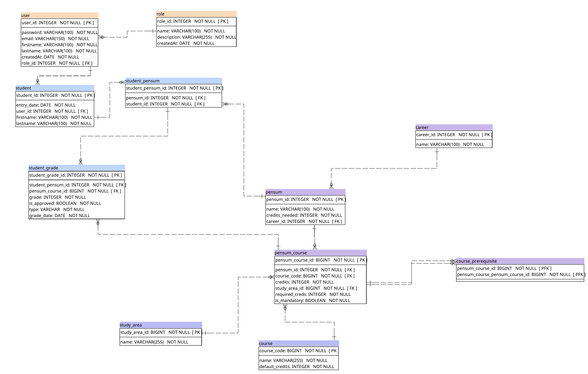

# Generación de horarios personales

# Descripción técnica

##  Actores

- **Administrador:** El administrador es el encargado de hacer una carga masiva de información y manejar la información de los cursos y pensums
- **Estudiante:** El estudiante podrá ver sus horarios, historial de la carrera y manejar sus posibles horarios.

## Historias de usuario

### Administrador

#### 1. Carga de pensums

**Como** administrador **quiero** poder cargar de manera masiva información de los pensums, **para** poder tener información de los cursos y las carreras que existen.

**Criterios de aceptación:**

- La carga no debe permitir cursos repetidos para la misma carrera (descartar)
- Se debe definir un formato de carga
- La carga debe indicar (en un resumen) lo que fue cargado exitosamente.
- La carga debe crear el registro de un curso si este no existe.

#### 2. Carga de historial de alumnos

**Como** administrador, **quiero** poder cargar de manera masiva información sobre el historial de los estudiantes, **para** que los estudiantes puedan ver su historial indivudualmente.

**Criterios**

- Se debe definir un formato de carga
- La carga debe validar que no existan 2 registros de cursos ganados para el mismo estudiante
- La carga debe crear un registro de un estudiante si este no existe.

#### 3. Agregar notas

Como administrador, quiero poder agregar registros de notas por estudiantes para que se vea su avance.

**Criterios de aceptación:**

- Se debe permitir agregar una nota a un estudiante (si no ha ganado el curso)
- Se debe mostrar un error si el estudiante no cumple con los requisitos del curso
- Se debe mostrar un error si el estudiante ya superó su límite de cursos.

### Estudiante

#### 1. Visualización de progreso en pensum

**Como** estudiante **quiero** ver el progreso de cursos ganados y pendientes de ganar en una pantalla en un pensum específico, **para** poder visualizar mis avances.

**Criterios de aceptación:**

- Se debe mostrar como una tabla en donde las columnas representen un semestre y cada fila represente un curso.
- Se debenmostrar los prerrequisitos de los cursos (créditos y otros cursos)
- Se debe mostrar los cursos información de los cursos (créditos que otorga y postrequisitos)
- Se deben marcar los cursos ganados, disponibles (se cumplen con los requisitos) y los bloqueados (no cumple con los requisitos).

#### 2. Horario personalizado

**Como** estudiante **quiero** generar un horario personalizado basado en el semestre, los cursos que puedo/quiero llevar **para** poder tener el mejor horario posible

**Criterios de aceptación:**

- El sistema debe consultar el horario “activo”.
- Dejar elegir al estudiante los cursos que desea llevar
- Por defecto se deben cargar los cursos obligatorios pendientes que puede llevar.
- Si un curso no está en el horario, entonces no se debe permitir seleccionar.\
- Si existen traslapes para diferentes cursos, el sistema debe dar opciones que el usuario pueda elegir
- El horario generado deberá ser descargado por el estudiante, la generación no se guarda solo la configuración. Si el estudiante quiere volver a consultar esa misma configuración, es posible que cambie.
- El horario debe detallar cursos, horarios y salones

#### 3. Notificaciones de cambios:

**Como** estudiante, **quiero** recibir notificaciones si el horario general cambia y esto afecta a mi horario **para** poder tener el mejor horario posible.

**Criterios de aceptación:**

- Se deberá enviar una notificación por correo electrónico al estudiante cuando un **horario general** que haya usado en alguna configuración cambie.

#### 4. Repitencias

**Como** estudiante **quiero** ver las repitencias que tengo en un curso específico **para** saber en qué cursos tengo peligro de “bloquearme”

**Criterios de aceptación:**

- Se debe mostrar una “alerta” o un color específico indicando que un curso está bloqueado por repitencias.

#### 5. Dashboard

Como estudiante quiero ver mi rendimiento académico a través de gráficas para entender mi rendimiento

**Criterios de aceptación:**

- Cantidad de cursos ganados y perdidos (desglosado por el último semestre y el histórico total).
- Porcentaje de aprobación (cursos ganados vs. cursados).
- Porcentaje de avance real de la carrera.
- Conteo de créditos acumulados y créditos faltantes para cerrar pensum.
- Top de cursos que "más costó ganar" (mayor cantidad de repitencias o menor nota).
- Promedio General (incluyendo cursos perdidos) y Promedio Limpio (calculado únicamente
con los cursos ganados).

## Base de datos

## Algoritmo Genético

El motor de generacion de horarios personales usa un algoritmo genetico para seleccionar combinaciones de secciones por curso que maximicen la factibilidad y la calidad del horario.

Etapas principales:

- **Poblacion inicial:** Se generan candidatos aleatorios eligiendo una seccion por curso disponible. Cada candidato representa una propuesta completa de horario.
- **Seleccion:** Se aplica un torneo entre varios candidatos y se escoge el de mejor puntaje para ser padre de la siguiente generacion.
- **Crossover:** Para cada curso se hereda aleatoriamente la seccion del padre A o del padre B, creando un hijo con mezcla de decisiones.
- **Mutacion:** Con una probabilidad definida se reemplaza la seccion elegida de un curso por otra opcion valida, para introducir diversidad.

Evaluacion y puntaje:

- Se penalizan fuertemente los traslapes de bloques horarios.
- Se penalizan los huecos entre clases en un mismo dia.
- Se bonifica incluir cursos obligatorios y cursos con mayor impacto en postrequisitos.
- El puntaje final se calcula con base en cursos incluidos, penalizaciones por traslapes y huecos, y bonificaciones por prioridad academica.

Parametros y condiciones de parada:

- **Tamano de poblacion:** 120 candidatos por generacion.
- **Mutacion:** 15% por candidato.
- **Elitismo:** 10% de la poblacion se preserva sin cambios.
- **Penalizacion por traslape:** 1000 puntos por cada conflicto adicional.
- **Penalizacion por huecos:** 8 puntos por cada espacio entre clases.
- **Bono por curso obligatorio:** 80 puntos.
- **Bono por postrequisitos:** 10 puntos por cada postrequisito asociado al curso.
- **Condiciones de finalizacion:** maximo 200 generaciones o 30 generaciones consecutivas sin mejora del mejor puntaje.

## Arquitectura y servicios de horarios

La generacion de horarios personales consume el servicio de horarios generales para obtener el horario activo y sus items asignados. La orquestacion principal ocurre en el servicio de horarios de estudiantes, que valida cursos, aplica reglas academicas (prerrequisitos y creditos), ejecuta el algoritmo genetico y persiste las alternativas generadas.

Conexion con horarios generales y webhook:

- El servicio de horarios generales consulta un endpoint externo para obtener horarios generados y mapear su estructura al dominio interno.
- Cuando un horario general se actualiza, se activa un webhook que notifica al backend. Este webhook invoca el flujo de notificacion y envia correo a los estudiantes que tengan horarios personales asociados a ese horario general.
- La notificacion no modifica horarios personales automaticamente; indica al estudiante que debe regenerar su horario para reflejar los cambios.
